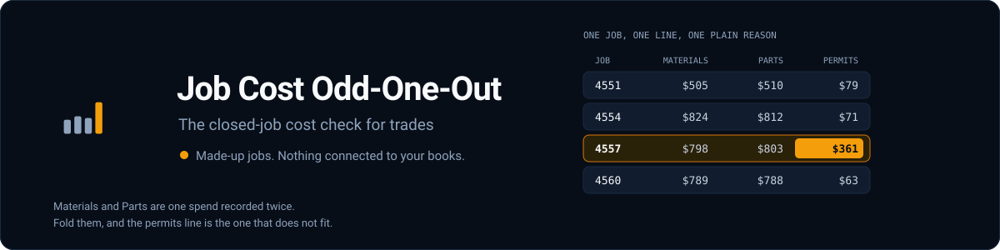
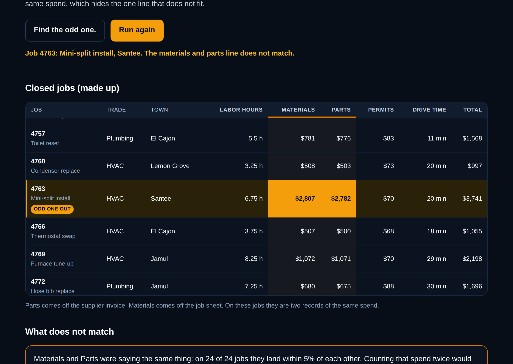
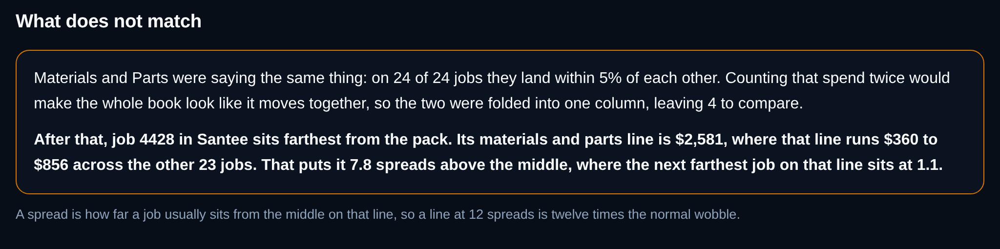
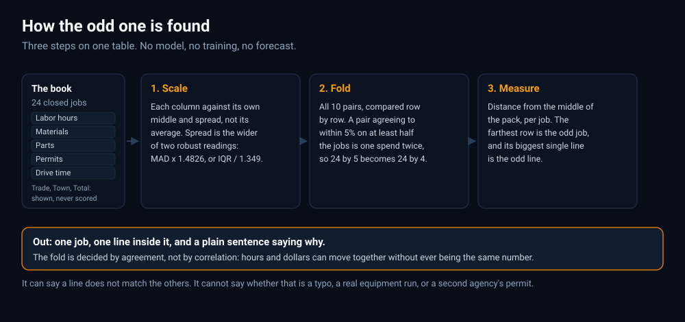

<p align="center">
  
</p>

<p align="center">
  <a href="https://github.com/IgorCSIS/job-cost-odd-one-out/actions/workflows/deploy.yml"></a>
  
  
</p>

# Job Cost Odd-One-Out

A job closes, the numbers get typed in, and nothing looks wrong until the
quarter is over. This page shows two dozen closed jobs for an East County HVAC
and plumbing shop and points at the one cost line that does not match the rest.

**Live:** https://igorcsis.github.io/job-cost-odd-one-out/

Every job on the page is made up. They are generated in the browser from a
seed, there is no import, no upload and no account, and the page says so
directly under its own heading:

> Demo only. These jobs are made up. Nothing is connected to your books.



## What it does

Press **Find the odd one.** and the page highlights one row, highlights the
line inside that row that put it there, and explains the result in two plain
paragraphs. **Run again** builds a different book, so the answer moves.



The table draws nine columns: the job (its invoice number and what the work
was), trade, town, labor hours, materials, parts, permits, drive time and a
total. Only five of those feed the arithmetic.

The interesting part is not the outlier. It is the pair of columns that hides
it. Materials comes off the job sheet and parts comes off the supplier invoice,
and on these books they are two records of the same spend. Count that spend
twice and every column looks like it moves together, which is the state most
small books are actually in.

## How the arithmetic works



Three steps, in `src/detect.ts`:

1. **Scale the columns.** Hours, dollars and minutes are not comparable as they
   are, so each column is measured against its own middle value and its own
   typical distance from that middle. The middle rather than the average,
   because an average is pulled toward whatever is unusual and the unusual
   thing is what is being looked for.
2. **Fold the duplicate.** All ten pairs are compared row by row. A pair whose
   raw figures agree to within 5% on at least half the jobs is one number
   recorded twice, so the two are averaged into one column. 24 by 5 becomes
   24 by 4.
3. **Measure the distance.** Each job's distance from the middle of the pack is
   the plain Euclidean length of its four scaled values. The farthest job is
   the odd one, and whichever of its four lines contributes most of that
   distance is the odd line.

That is linear algebra on a 24 by 5 table. It does not learn, it does not
forecast, and it has no opinion about what a job should cost. It can say a line
does not match the others. It cannot say whether that is a typo, a real
equipment run, or a permit from a second agency, and the copy does not pretend
otherwise.

Three details worth naming:

- **The fold is decided by agreement, not by correlation.** Correlation asks
  whether two columns move together, which labor hours and materials genuinely
  do without ever being the same number. "One spend recorded twice" means the
  two figures *are* the same figure, which is what agreement tests. See
  [the threshold](#the-threshold) for what happened when this was a
  correlation bar instead.
- **The spread is the wider of two robust readings:** the median absolute
  deviation scaled by 1.4826, or the interquartile range divided by 1.349.
  Either one alone can collapse on 24 points, and when the divisor collapses
  an ordinary figure scores as extreme.
- **Totals are never scored.** A total is labor plus materials plus permits, so
  scoring it would count those three a second time and the biggest job would
  win every run regardless of what was actually out of pattern. Trade and town
  are not scored either. All three are drawn because an owner expects to see
  them.

### The threshold

A pair is folded when its raw figures agree to within `CLOSE_TOLERANCE` (5%) on
at least `DUPLICATE_CLOSE_SHARE` (half) of the jobs. Measured over 300,000
generated books:

| Pair | Rows it agrees on |
| --- | --- |
| Materials against parts, which really is one spend recorded twice | **24 of 24, every book** |
| The closest any other pair came | **2 of 24** |

The bar sits at 12, which is 12 rows clear of one failure mode and 10 clear of
the other.

It was not always this. The gate used to be a bar on the rank correlation set
at `0.95`, chosen from a sweep of 20,000 seeds that put the true pair no lower
than `0.97` and the closest honest pair no higher than `0.90`. Both numbers
were real and the conclusion was wrong, because the page does not seed from
that range: `src/main.ts` draws from `(Date.now() % 2000000) + 1`. Over those
two million books the true pair falls to `0.947` and the closest honest pair
reaches `0.942`, so the bar sat inside both ranges at once. In two of those
books the fold failed, and the page named the cheapest job in the book, in
confident language, while the planted anomaly went unmentioned. That is exactly
the false finding the threshold existed to prevent.

The lesson was not that the number needed tuning. It was that correlation was
the wrong measurement.

## How well it works

Measured over **all 2,000,000 books the page can generate**, which is the full
range `src/main.ts` can seed from, not a sample of it:

| | Result |
| --- | --- |
| Reports the planted row and the planted line | **1,999,990 of 2,000,000** (99.9995%) |
| Picks materials and parts as the duplicate | 2,000,000 of 2,000,000 |
| Rows that pair agrees on, worst book | 24 of 24 |
| Books where the fold fails | 0 |
| How far out the odd line sits | median 11.5 spreads, never below 3.5 |

The ten it gets wrong all have the same shape: the planted line was materials,
and a legitimately long drive or a boundary labor figure in the same book
scored higher. Before the two fixes above, the same sweep returned 1,999,907.

These numbers are not printed on the page and should not be. They describe
synthetic books of a known shape, not anybody's real accounts.

## Running it

```
npm install
npm run dev        # local dev server
npm run build      # typecheck, then bundle into dist/
npm run typecheck  # types only
```

`npm run build` runs `tsc --noEmit` before Vite, so a type error fails the
build rather than shipping. TypeScript is in strict mode with
`noUncheckedIndexedAccess`.

Imports carry their `.ts` extension, which lets `node --experimental-strip-types`
load `src/data.ts` and `src/detect.ts` directly. That is how the sweeps above
were run, with no bundler in the loop.

## Layout

```
index.html                              the page
src/main.ts                             wiring, table drawing, highlighting
src/detect.ts                           scale, fold, measure distance
src/data.ts                             the seeded synthetic job book
src/explain.ts                          findings turned into sentences
src/format.ts                           how dollars, hours and minutes print
src/styles.css                          the contractor lane, one accent
public/logo.svg, public/favicon.svg     four bars, one of them odd
assets/how-it-works.svg                 the pipeline diagram above
assets/banner.svg                       the README banner
assets/shots/                           README screenshots, from the built page
vite.config.ts                          base path and the CSP concession
tsconfig.json                           strict, and .ts import specifiers
package.json, package-lock.json         two dev dependencies, none at runtime
.github/workflows/deploy.yml            build, then publish dist to Pages
.github/workflows/no-ai-attribution.yml the attribution check
CONVENTIONS.md                          the rules anything writing here follows
README.md                               this file
LICENSE                                 MIT
.gitignore
```

`public/` is what Vite copies into the site. `assets/` is README material and
is deliberately outside it, so the screenshots do not ship to the live page.

## Security notes

The page declares a Content-Security-Policy in a meta tag as the first element
in `<head>`, with `default-src 'none'` and `connect-src 'none'`. The second one
is the one that matters: this page talks to nothing, so there is no endpoint a
cost figure could leak to, and the policy makes that a rule instead of a
promise. There is no `fetch`, no `XMLHttpRequest`, no `localStorage` and no
`sessionStorage` anywhere in `src/`.

Two honest limits:

- `frame-ancestors` cannot be set from a meta tag, only from a response header,
  and GitHub Pages does not let you set headers. So this page can be framed.
  There is nothing on it to clickjack, but the gap is real.
- Because the policy has no `unsafe-inline`, Vite's module-preload polyfill is
  switched off in `vite.config.ts`. It is an inline script and would be blocked.

The DOM is built with `createElement` and `textContent` throughout. No file in
`src/` calls `innerHTML`, `outerHTML`, `insertAdjacentHTML`, `document.write`,
`eval` or `new Function`. Those names appear in this repository only in
comments and rules saying they are not used, including this sentence.

One query parameter is read, `?fail=1`, which forces the error path on first
load so the failure state can be checked without breaking the build on purpose.
It is matched against a whitelist and never printed back onto the page. Pressing
either button afterwards starts a normal run.

## Dependencies

None at runtime. TypeScript and Vite are build-time only. `npm run build` emits
five files totalling **29,425 bytes** before compression: one HTML file, one
stylesheet, one script (28,175 bytes between them) and two SVGs that Vite copies
through from `public/`. Those two are byte-identical to each other, one serving
as the favicon and one as the wordmark. No fonts are fetched; the page uses the
system stack.

## The rest of the chain

Respond fast, follow up, win the job, ask for the review, check the books:

- [Instant Lead Response](https://github.com/IgorCSIS/instant-lead-response)
- [Lead Follow-up](https://github.com/IgorCSIS/lead-followup)
- [Ridgeview Remodeling](https://github.com/IgorCSIS/ridgeview-remodeling-demo)
- [Review Ask](https://github.com/IgorCSIS/review-ask)
- Job Cost Odd-One-Out, this one

## License

MIT. See [LICENSE](LICENSE).
